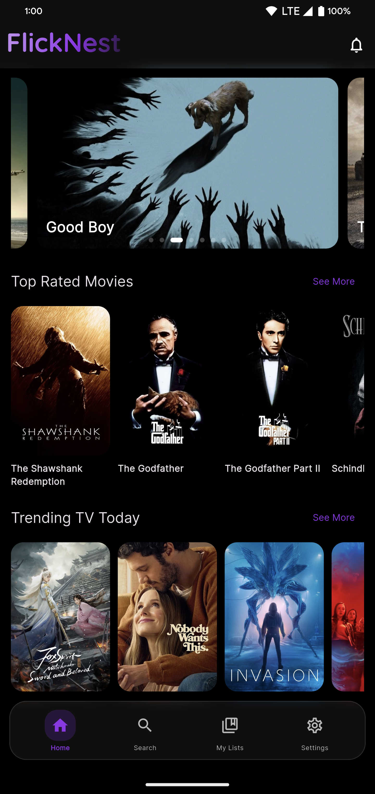
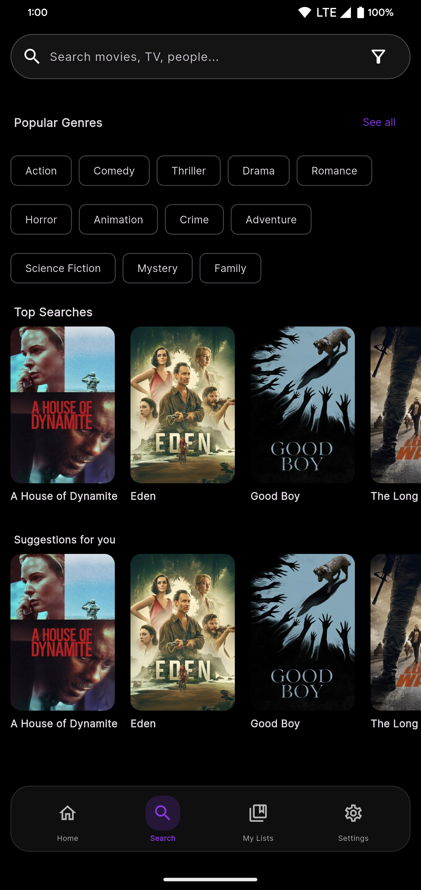
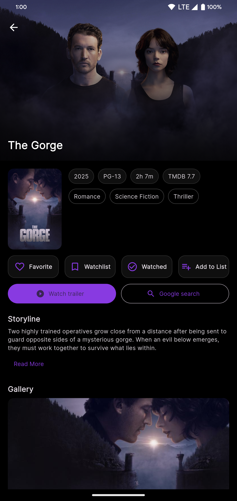
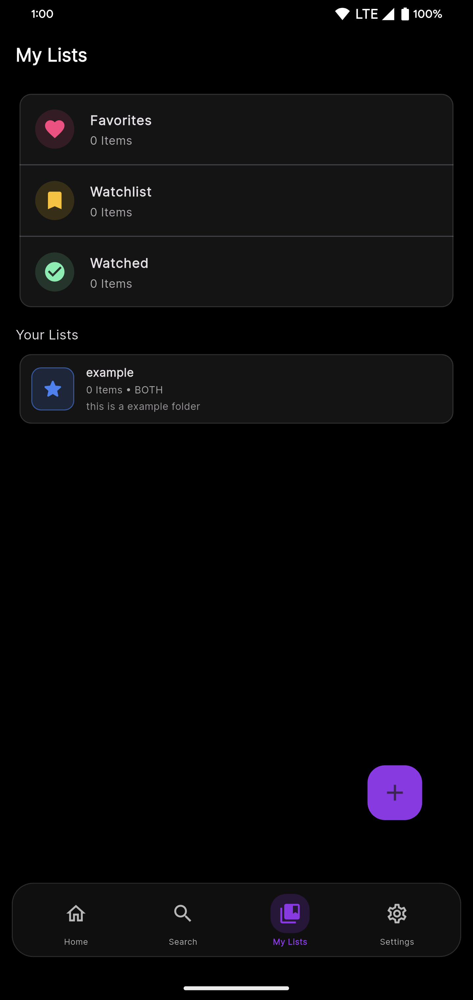
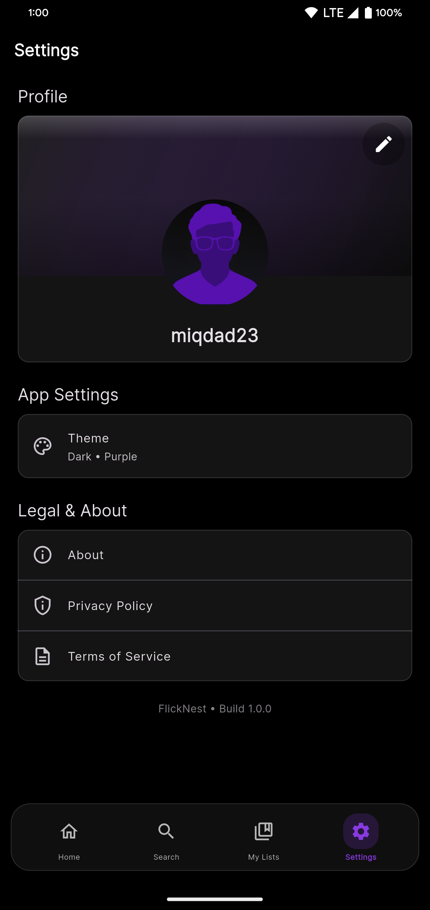

# 🎬 FlickNest

A beautiful, offline-first movie and TV show explorer app built with Flutter. Browse trending titles, create custom lists, and manage your watchlist—all without requiring sign-in or cloud services.

<p align="center">
  <a href="https://github.com/miqdad23/FlickNest/releases">
    
  </a>
  <a href="https://github.com/miqdad23/FlickNest/releases">
    
  </a>
  
  
  
  
</p>

<p align="center">
  <a href="https://github.com/miqdad23/FlickNest/releases/latest">
    
  </a>
</p>

---

## 📸 Screenshots

<p align="center">
  
  
  
  
  
</p>

---

## ✨ Features

### 🎯 Core Features
- **Offline-First**: All data stored locally on your device
- **No Sign-In Required**: Use the app without creating an account
- **Beautiful UI**: Material 3 design with 9 brand color themes
- **Dark & Light Mode**: System-aware theme switching

### 🎬 Movie & TV Browsing
- Browse trending, popular, top-rated movies and TV shows
- Search across movies, TV shows, and people
- Advanced filters: year range, genres, ratings, languages, countries
- Discover by genre
- View detailed information, cast, crew, trailers, and recommendations

### 📚 Personal Lists
- **3 Default Lists**: Favorites, Watchlist, Watched
- **Custom Lists**: Create unlimited custom lists with:
  - Custom names, descriptions, icons, and colors
  - Filter by Movie-only, TV-only, or Both
  - Advanced search, sort, and filter within lists
  - Multi-select and batch operations

### 👤 Profile
- Local profile with custom name, avatar, and cover photo
- Camera or gallery image picker support

### 🔍 Search & Discovery
- Multi-tab search (All, Movies, TV, People)
- Filter by type, year, genres, languages, countries, ratings
- Sort by relevance, popularity, or release date
- Recent search history

---

## 🚀 Getting Started

### Prerequisites

- Flutter SDK 3.9.2 or higher
- Android Studio / VS Code
- Android SDK (API 21+)
- TMDB API Key ([Get it here](https://www.themoviedb.org/settings/api))

### Installation

1. **Clone the repository**
   ```bash
   git clone https://github.com/miqdad23/FlickNest.git
   cd FlickNest